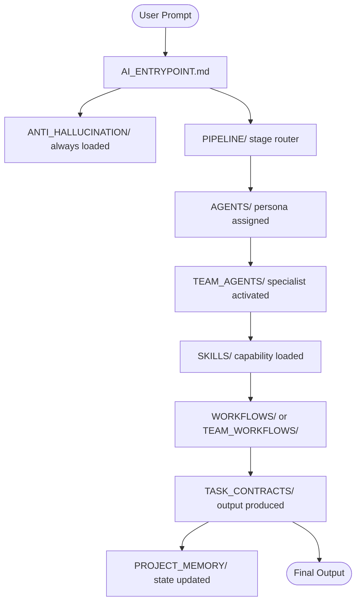

<div align="center">

<div align="center">

<pre>
█████╗  ██████╗ ███████╗███╗   ██╗████████╗██╗ ██████╗
██╔══██╗██╔════╝ ██╔════╝████╗  ██║╚══██╔══╝██║██╔════╝
███████║██║  ███╗█████╗  ██╔██╗ ██║   ██║   ██║██║     
██╔══██║██║   ██║██╔══╝  ██║╚██╗██║   ██║   ██║██║     
██║  ██║╚██████╔╝███████╗██║ ╚████║   ██║   ██║╚██████╗
╚═╝  ╚═╝ ╚═════╝ ╚══════╝╚═╝  ╚═══╝   ╚═╝   ╚═╝ ╚═════╝

> initializing agentic-dev framework...
> loading anti-hallucination guards ███████░░░ 70%
> binding pipeline engine ██████████ 100%
> system ready.

[ AGENTIC DEV FRAMEWORK v3.1 ELITE ]
</pre>

</div>


**A production-grade, anti-hallucination prompt framework**  
**that helps transform LLMs into structured, disciplined engineering assistants.**

<br/>

[](.)
[](LICENSE)
[](.)
[](.)
[](.)
[](https://github.com/dhanu-17-git)

<br/>

> *Stop fighting your AI. Make it follow rules.*

</div>

---

## ⚡ Quick Start (10 seconds)

1. Open your AI IDE (Antigravity / Cursor / Windsurf / Copilot)
2. Paste:
   `"Read ai-tool-kit/AI_ENTRYPOINT.md"`
3. Ask your task:
   `"Build authentication system with JWT"`

→ The AI will automatically:
* Load guardrails
* Follow the full 9-stage pipeline
* Generate structured contracts + code

---



## The Problem

Every developer using AI for code has hit the same wall:

- 🤦 AI invents files that don't exist
- 🔁 AI ignores your architecture and rewrites everything
- 📉 Context degrades over a long session — AI forgets what it built 10 messages ago
- ⚠️ No planning, no contracts, no accountability — just vibes

**Agentic Dev Framework** fixes this by forcing the AI to operate inside a strict **9-stage pipeline** with **task contracts**, **project memory**, and **anti-hallucination guards** — before writing a single line of code.

---

## ⚙️ How It Works

**1. Install**
Drop the `ai-tool-kit/` folder into any project root. 
*(No configuration or setup scripts required.)*

**2. Initialize**
Tell Antigravity / Cursor / Windsurf / Copilot:
> `"Read ai-tool-kit/AI_ENTRYPOINT.md"`

**3. Execute**
Ask for what you want in plain English:
> `"Build a user authentication system with JWT and refresh tokens"`

*The AI auto-detects the task, loads only the necessary context, and executes the 9-stage pipeline.*

---

## The 9-Stage Pipeline

The AI **cannot skip stages.** Each stage produces a contract that the next stage must consume.

```
┌─────────────────────────────────────────────────────────────────┐
│                    AGENTIC DEV PIPELINE                         │
├─────────────────────────────────────────────────────────────────┤
│                                                                 │
│   [1] BRAINSTORMING ──── Explores solution space               │
│          │                                                      │
│   [2] REPO MAPPER ────── Scans actual files (no inventing)     │
│          │                                                      │
│   [3] ARCHITECT ─────── Produces → feature_contract.md        │
│          │                          ↑ must be approved         │
│   [4] PLANNER ───────── Produces → implementation_plan.md     │
│          │                          ↑ must be approved         │
│   [5] CODER ─────────── Produces → patch_contract.md          │
│          │                          ↑ tracks every change      │
│   [6] TESTER ────────── Validates against contract            │
│          │                                                      │
│   [7] LINT & VALIDATE ── No untested code ships               │
│          │                                                      │
│   [8] REVIEWER ─────── Self-review against original spec      │
│          │                                                      │
│   [9] SECURITY ─────── OWASP + injection + secrets scan       │
│                                                                 │
└─────────────────────────────────────────────────────────────────┘
```

👉 **Output of the pipeline:**
* **Structured contract:** What was designed and agreed upon.
* **Verified code changes:** What was actually modified and patched.
* **Memory updates:** What the system learned for your next session.

---

## Context-Aware Loading

The AI doesn't load all 82 files for every task. The smart entrypoint (`AI_ENTRYPOINT.md`) auto-detects task type and loads **only what's needed** — keeping context usage minimal.

| Task Type | Files Loaded | Est. Tokens |
|-----------|-------------|-------------|
| Quick Fix | ~2 files | ~300 |
| Debug Session | ~4 files | ~1,200 |
| Code Review | ~3 files | ~900 |
| Frontend Build | ~6 files | ~3,500 |
| Project Bootstrap | ~8 files | ~8,000 |
| Full Feature Dev | ~12 files | ~12,000 |

---

👉 **You don’t need to understand every file here.**  
Start with `AI_ENTRYPOINT.md` — the system will guide itself.

## Project Structure — Highly Minimized

<details>
<summary><strong>📂 Expand full directory tree</strong></summary>

```
ai-tool-kit/
│
├── AI_ENTRYPOINT.md              ← Smart bootloader — start every session here
├── SYSTEM_PROMPT.md              ← Full execution rules for the AI
├── README.md
│
├── PIPELINE/                     ← Stage execution & handoff rules
│   ├── agent_pipeline.md
│   └── agent_handoff_rules.md
│
├── TASK_CONTRACTS/               ← Structured output contracts per stage
│   ├── feature_contract.md       ← Architect output
│   ├── implementation_plan.md    ← Planner output
│   └── patch_contract.md         ← Coder output (tracks every file change)
│
├── AGENTS/                       ← Core agent role definitions
│   ├── architect.md
│   ├── builder.md
│   ├── reviewer.md
│   └── debugger.md
│
├── TEAM_AGENTS/                  ← Extended team (6 specialists)
│   ├── planner.md
│   ├── coder.md
│   ├── tester.md
│   ├── reviewer.md
│   ├── security.md
│   └── documenter.md
│
├── ANTI_HALLUCINATION/           ← Split conditional logic (Core vs Extended)
│   ├── core_rules.md             ← Loads every time
│   └── extended_rules.md         ← Loads only for complex features
│
├── PROJECT_MEMORY/               ← Scaled-back, state-only persistence
│   ├── active_context.md
│   ├── architecture.md
│   └── decisions.md
│
├── REPO_INTELLIGENCE/            ← Deep codebase understanding layer
│   ├── repo_summary.md
│   ├── repo_overview.md
│   ├── module_index.md
│   ├── api_map.md
│   ├── database_map.md
│   ├── service_dependency_map.md
│   ├── route_structure.md
│   └── db_relationships.md
│
├── SKILLS/                       ← 19 specialist skill modules
│   ├── brainstorming.md
│   ├── tdd_workflow.md
│   ├── lint_and_validate.md
│   ├── git_workflow.md
│   ├── repo_reader.md
│   ├── architecture_planner.md
│   ├── patch_editor.md
│   ├── self_review.md
│   ├── secure_coding.md
│   ├── test_generator.md
│   ├── dependency_eval.md
│   ├── context_loader.md
│   ├── error_recovery.md
│   ├── frontend_design.md        ← UI aesthetics & component rules
│   ├── database_operations.md    ← Data safety rules
│   ├── silent_failure_hunter.md  ← Elite: finds suppressed errors
│   ├── type_design_analyzer.md   ← Elite: type system analysis
│   └── code_simplifier.md        ← Elite: reduces cognitive load
│
├── CONTEXT/                      ← AI operating rules & constraints
│   ├── coding_rules.md
│   ├── load_rules.md
│   ├── ignore_rules.md
│   ├── file_priority.md
│   ├── naming_conventions.md
│   ├── memory_rules.md
│   └── intelligence_rules.md
│
├── WORKFLOWS/                    ← 7 reusable development workflows
│   ├── project_bootstrap.md      ← Zero-to-one starter
│   ├── feature_development.md
│   ├── debugging.md
│   ├── refactoring.md
│   ├── testing.md
│   ├── code_review.md
│   └── ai_safe_feature_flow.md
│
├── TEAM_WORKFLOWS/               ← Multi-stage team pipelines
│   ├── full_feature_pipeline.md
│   └── hotfix_pipeline.md
│
├── DOC_TEMPLATES/                ← 5 production documentation templates
│   ├── architecture_template.md
│   ├── module_summary_template.md
│   ├── dev_rules_template.md
│   ├── feature_spec_template.md
│   └── api_documentation_template.md
│
└── IMPORTS/                      ← External skill packs
    └── antigravity-awesome-skills/
        ├── codebase_map.md
        ├── incremental_dev.md
        ├── debug_investigator.md
        ├── dependency_eval.md
        └── prompt_optimizer.md
```

</details>

---

## Safeguard Systems

| System | Problem It Solves |
|--------|-------------------|
| 🛡️ **Anti-Hallucination** | AI inventing files, breaking existing layers, triggering massive rewrites |
| 📋 **Task Contracts** | Free-form reasoning, skipped planning, untracked file changes |
| 🧠 **Project Memory** | Contradicted decisions, duplicated features, forgotten architecture |
| 🔗 **Pipeline Gates** | Skipped stages, missing handoffs, orphaned contracts |
| ✅ **Lint & Validate** | Unchecked code shipping without quality gates |
| 🔒 **Security Agent** | OWASP violations, injection vectors, hardcoded secrets |

---

## Compatible With

| LLM | AI IDE | Works? |
|-----|--------|--------|
| Claude 4.6 Sonnet | Antigravity IDE | ✅ |
| GPT-5.4 | Cursor | ✅ |
| Gemini 3.1 Pro | Windsurf | ✅ |
| Any instruction-following LLM | Any AI IDE with file context | ✅ |

---

## Why This Exists

Most AI coding frameworks focus on **what the AI can do.**  
This one focuses on **what the AI is not allowed to do.**

The insight: LLMs are powerful but undisciplined. They'll skip your architecture, invent imports, and hallucinate function signatures — not out of malice, but because no one gave them a contract to follow.

**Agentic Dev Framework** is that contract. Every file is a constraint. Every stage is a gate. The AI becomes a disciplined engineer instead of an enthusiastic intern.

---

## Getting Started

**Option A — New Project**
```bash
git clone https://github.com/dhanu-17-git/Agentic-Dev-Framework-.git
cp -r Agentic-Dev-Framework-/ai-tool-kit/ your-new-project/
```

**Option B — Existing Project**
```bash
# From your project root:
git clone https://github.com/dhanu-17-git/Agentic-Dev-Framework-.git temp-adf
cp -r temp-adf/ai-tool-kit/ .
rm -rf temp-adf
```

Then in your AI IDE:
```
"Read ai-tool-kit/AI_ENTRYPOINT.md and follow all rules defined there."
```

That's it. The framework is active.

---

## Recommended GitHub Topics

> Add these to your repo's **About** section for discoverability:

`ai-toolkit` `prompt-engineering` `agentic-ai` `cursor` `windsurf` `llm` `anti-hallucination` `software-architecture` `developer-tools` `ai-coding` `claude` `gpt4` `gemini` `multi-agent`

---

## License

MIT License © 2026 Dhanush M

Permission is hereby granted, free of charge, to any person obtaining a copy of this software to use, copy, modify, merge, publish, distribute, sublicense, and/or sell copies, subject to the standard MIT conditions.

---

<div align="center">

**Built with obsession by [Dhanush M](https://github.com/dhanu-17-git)**

*If this framework saved you from an AI hallucination nightmare — give it a ⭐*

</div>
